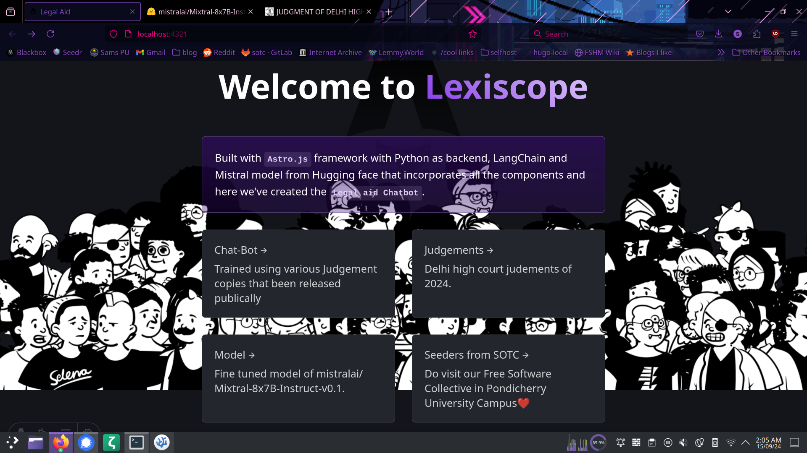
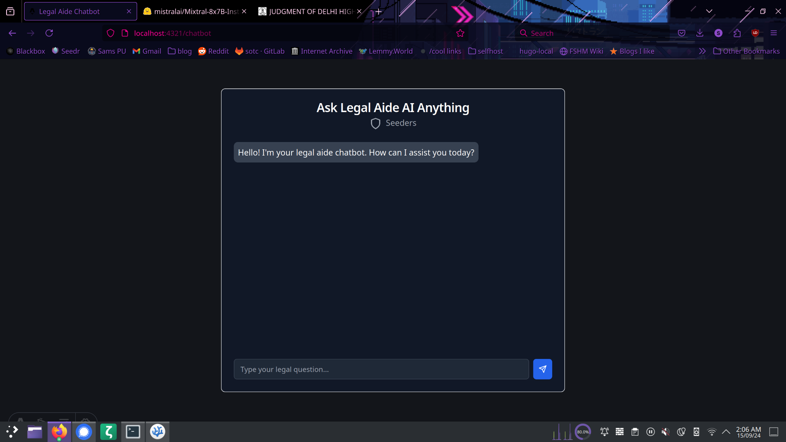

# Legal-Aid

 Home Page 
 Chat Bot

## Languages, Frameworks, Tools used

- Astro.js framework
- astro integration with React
- Tailwind CSS for styling
- Python
- Mistral (Hugging Face)
- AI framework - LangChain


## Build, test and run

- Clone the repository
```shell
$ git clone https://github.com/SridharRG/legalaid.git
```
- Install all dependencies

```shell
$ pip install -r requirements.txt
```

```shell
$ npm i
```
- Run the server
    ```shell
    $ npm start
    ```

    The application will be running at `http://localhost:4321`

- 
    - Running the Backend
    ```shell
    $ uvicorn legal_model:app --host 0.0.0.0 --port 8000 --reload
    ```
    
    This will start the FastAPI server at http://0.0.0.0:8000/api/legal-assist/.

## 🚀 Project `Astro.js` Snippets


- Astro looks for `.astro` or `.tsx` files in the `src/pages/` directory. Each page is exposed as a route based on its file name.

- There's nothing special about `src/components/`, but that's where we like to put any Astro/React components.

- Any static assets, like images, can be placed in the `public/` directory.


## 🧞 Commands

All commands are run from the root of the project, from a terminal:

| Command                   | Action                                           |
| :------------------------ | :----------------------------------------------- |
| `npm install`             | Installs dependencies                            |
| `npm run dev`             | Starts local dev server at `localhost:4321`      |
| `npm run build`           | Build your production site to `./dist/`          |
| `npm run preview`         | Preview your build locally, before deploying     |
| `npm run astro ...`       | Run CLI commands like `astro add`, `astro check` |
| `npm run astro -- --help` | Get help using the Astro CLI                     |

## Knowledge is Free!!

Feel free to folk or clone to improve the project [Astro documentation](https://docs.astro.build)
